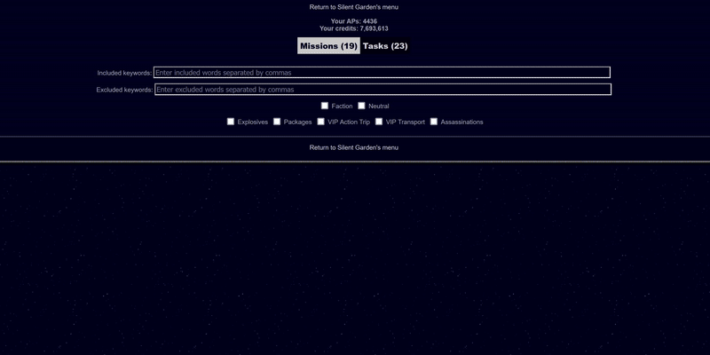

# About 

Adds filters to the Bulletin Board section of the MMORPBG [Pardus](https://www.pardus.at), allows the user to filter missions by keywords (hide mission if a mission contains or does not contain keywords).

Missions can also be filtered by type: faction/neutral, package, explosives, VIP etc.

Filters persist between browser sessions.

*not tested for premium compact mode

# Installation
Tampermonkey, Greasemonkey or Violentmonkey required.

Simply download the .js file and load it (install) from the Monkey's dashboard.